# MODFLOW -- Conceptual Model Approach 1

*GMS 10.9 Tutorial*

Build a basic MODFLOW model using the conceptual model approach

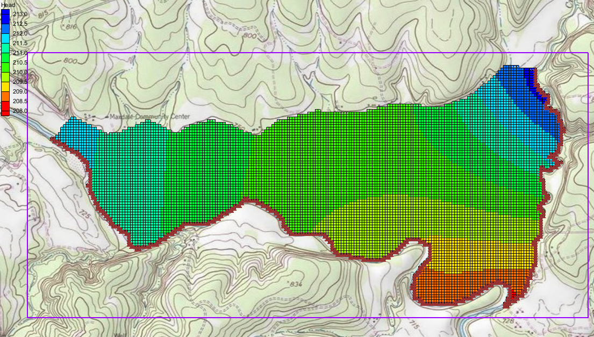

## Objectives

The conceptual model approach involves using the GIS tools in the Map module to develop a conceptual model of the site being modeled. The location of sources/sinks, model boundaries, layer parameters (such as hydraulic conductivity), and all other data necessary for the simulation can be defined at the conceptual model level without a grid.

| Prerequisite Tutorials | Required Components | Time |
|---|---|---|
| Feature Objects, MODFLOW -- Grid Approach | GMS Core, MODFLOW Interface | 20--30 minutes |

---

## 1 Introduction

Two approaches can be used to construct a MODFLOW simulation in GMS: grid or conceptual model. The grid approach works directly with the 3D grid and applies sources/sinks, and other model parameters on a cell-by-cell basis. The steps involved in the grid approach are described in the "MODFLOW -- Grid Approach" tutorial.

In this tutorial, an outer boundary will be created for the model. The rivers will be defined and heads will be assigned to the various arcs in the boundary before building the coverage polygons. The hydraulic conductivity and layer elevations of the aquifer will be defined. A grid frame will be created and a grid will be created within it.

The MODFLOW active and inactive zones will be defined, the conceptual model will be converted to a grid-based model, the starting head will be assigned, and the simulation will then be run. The problem solved in this tutorial is illustrated in Figure 1.

This tutorial models the groundwater flow in the valley sediments bounded by the hills to the north and the two converging rivers to the south of a site in eastern Texas in the United States. The boundary to the north will be a no-flow boundary and the remaining boundary will be a general head boundary corresponding to the average stage of the rivers.

It is necessary to assume that the influx to the system is primarily through recharge due to rainfall. There are some creek beds in the area which are sometimes dry but occasionally fill up due to influx from the groundwater. These creek beds will be represented using drains. Two production wells in the area will also be included in the model.

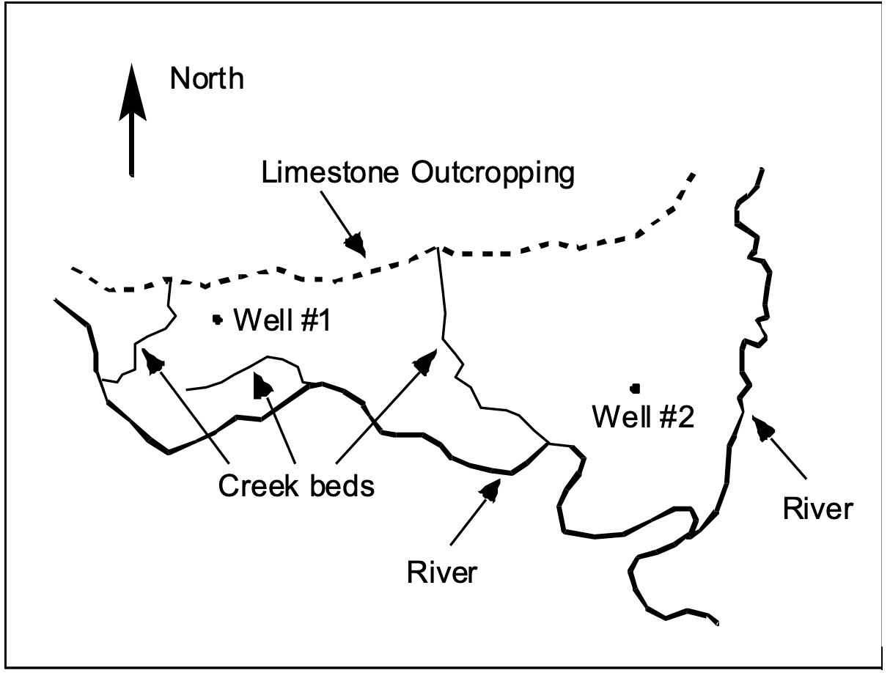

*Figure 1: Plan view of site to be modeled*

This tutorial discusses and demonstrates the following key concepts:

- Importing a background image
- Creating and defining coverages
- Mapping the coverages to a 3D grid
- Checking the simulation and running MODFLOW

### 1.1 Getting Started

Do the following to get started:

1. If necessary, launch GMS.
2. If GMS is already running, select *File* | **New** to ensure that the program settings are restored to their default state.

---

## 2 Importing the Background Image

Before setting up the simulation, import a digital image of the site being modeled. This image was created by scanning a portion of a USGS quadrangle map on a desktop scanner. The image was imported into GMS, registered, and a GMS project file was saved.

Once the image is imported into GMS, it can be displayed in the background as a guide for on-screen digitizing and placement of model features.

Import the image by doing the following:

1. Click **Open**  to bring up the *Open* dialog.
2. Select "Project Files (*.gpr)" from the *Files of type* drop-down.
3. Browse to the *modfmap1* directory and select "start.gpr".
4. Click **Open** to import the project file and close the *Open* dialog.

The Graphics Window will appear as in Figure 2. All other objects in GMS are drawn on top of the image. The image will only appear in plan view.

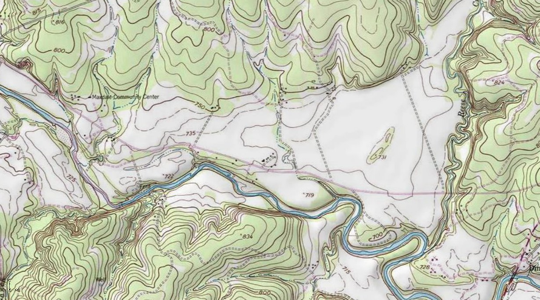

*Figure 2: The imported map*

---

## 3 Saving the Project

Before making any changes, save the project under a new name.

1. Select *File* | **Save As...** to bring up the *Save As* dialog.
2. Select "Project Files (*.gpr)" from the *Save as type* drop-down.
3. Enter "easttex.gpr" for the *File name*.
4. Click **Save** to save the project under the new name and close the *Save As* dialog.

It is recommended to periodically **Save**  while working through the tutorial and while working on any project.

---

## 4 Defining the Boundary

The first step is to define the outer boundary of the model. This will be done by creating an arc that forms a closed loop around the site. When building a model, it is recommended to build one component at a time. This makes it easier to resolve problems with the model later on.

### 4.1 Creating the Coverage

1. Right-click on the empty space in the Project Explorer and select *New* | **Conceptual Model...** to bring up the *Conceptual Model Properties* dialog.
2. Enter "East Texas" for the *Name*.
3. Select "MODFLOW" from the *Type* drop-down.
4. Click **OK** to close the *Conceptual Model Properties* dialog.
5. Right-click on the " East Texas" conceptual model and select **New Coverage...** to bring up the *Coverage Setup* dialog.
6. Enter "Boundary" for the *Coverage name*.
7. Enter "213.0" as the *Default elevation*.
8. Click **OK** to close the *Coverage Setup* dialog.

### 4.2 Creating the Arc

Normally a boundary arc will be manually digitized. To see how this is done, do the following:

1. Select the new " Boundary" coverage to make it active and to switch to the Map module.
2. Using the **Create Arc**  tool, click out an arc beginning at point (a) in Figure 3, following the river southeast as shown (b), then northeast from the convergence (c), then along the foot of the limestone outcroppings on the north (d) until back at the start point (e). Don't worry about the spacing or the exact location of the points; just use enough points to define the approximate location of the boundary.
3. To end the arc, click on the starting point.

If a mistake is made while clicking on the points, press the *Backspace* key to backup. If wanting to abort the arc before completing it, and start over, press the *Esc* key.

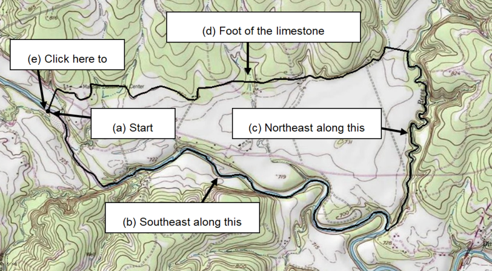

*Figure 3: Creating the boundary arc*

For consistency purposes, a previously generated arc will be imported for use during the rest of the tutorial.

4. Right-click on the " East Texas" conceptual model and select **Delete**.
5. Click **Open**  to bring up the *Open* dialog.
6. Select "Map Files (*.map)" from the *Files of type* drop-down.
7. Browse to the *modfmap1* directory and select "Boundary.map".
8. Click **Open** to import the project file and close the *Open* dialog.

The " East Texas" conceptual model will reappear with an arc on a " Boundary" coverage that will be used for the rest of the tutorial.

---

## 5 Defining the Rivers

The next step in building the conceptual model is to construct the local sources/sinks coverage. This coverage defines the boundary of the region being modeled and defines local sources/sinks including wells, rivers, drains, and general head boundaries.

The properties that can be assigned to the feature objects in a coverage depend on the conceptual model and the options set in the *Coverage Setup* dialog. Before creating the feature objects, it is necessary to change these options.

1. Right-click on the " Boundary" coverage and select **Duplicate** to create a new " Copy of Boundary" coverage.
2. Right-click on " Copy of Boundary" and select **Properties...** to bring up the *Coverage Properties* dialog.
3. For the *Coverage name*, enter "Rivers" and press the *Enter* key.
4. Click **OK** to close the *Coverage Properties* dialog.
5. Right-click on " Rivers" and select **Coverage Setup...** to bring up the *Coverage Setup* dialog.
6. In the *Sources/Sinks/BCs* column, turn on *General Head*.
7. Near the bottom left of the dialog, turn on *Use to define model boundary (active area)*.
8. Click **OK** to close the *Coverage Setup* dialog.

### 5.1 Assigning the Head Arcs

The next step is to define the head boundaries along the south and east sides of the model. Before doing this, however, it is necessary to first split the arc that was just created into three arcs. One arc will define the no-flow boundary along the top, and the other two arcs will define the two rivers. An arc is split by selecting one or more vertices on the arc and converting the vertices to nodes.

1. Select " Rivers" in the Project Explorer to make it active.
2. Using the **Select Vertices** 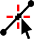 tool, select the two vertices shown in Figure 4 by selecting one of them, then holding down the *Shift* key and selecting the other one. Vertex #1 is located at the junction of the two rivers. Vertex #2 is located at the top of the river on the east side of the model.
3. Right-click on one of the selected vertices and select **Vertex** &rarr; **Node** to change them into nodes.

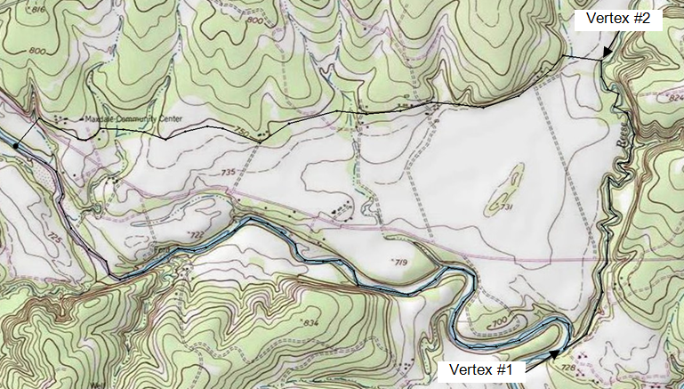

*Figure 4: Convert vertices to nodes*

Now that the three arcs have been defined, the two arcs on the rivers should be classified as specified head arcs.

4. Using the **Select Arcs**  tool, select the arcs on the south and east sides (right and bottom) of the model by selecting one arc and holding down the *Shift* key while selecting the other arc.
5. Right-click on one of the selected arcs and select **Attribute Table...** to bring up the *Attribute Table* dialog.
6. On the *All* row, select "gen. head" from the drop-down in the *Type* column. This will change the types for both arcs.
7. On the *All* row, enter "1.0" for the *Cond (m^2/d)/(m)* column.
8. Click **OK** to close the *Attribute Table* dialog.
9. Click anywhere on the model other than on the arcs to unselect them. Notice that the color of the arcs has changed to indicate the arc type.

The next step is to define the head at the nodes at the ends of the arcs. The head along a specified head arc is assumed to vary linearly along the length of the arc.

10. Using the **Select Points/Nodes**  tool, double-click on the western (left) node of the arc on the southern (bottom) boundary to bring up the *Attribute Table* dialog.
11. Enter "212.0" on row *1* (with *Type* "gen. head") in the *Head-Stage (m)* column.
12. Click **OK** to close the *Attribute Table* dialog.
13. Using the **Select Points/Nodes**  tool, double-click on the eastern (right) node of the arc on the southern (bottom) node where the rivers converge to bring up the *Attribute Table* dialog.
14. Enter "208.0" on row *3* in the *Head-Stage (m)* column.
15. Click **OK** to close the *Attribute Table* dialog.
16. Using the **Select Points/Nodes**  tool, double-click on the northern (top) node of the arc on the east (right) boundary to bring up the *Attribute Table* dialog.
17. Enter "214.0" on row *4* (with *Type* "gen. head") in the *Head-Stage (m)* column.
18. Click **OK** to close the *Attribute Table* dialog.

### 5.2 Building the Polygons

With the local sources/sinks type coverage, the entire region to be modeled must be covered with non-overlapping polygons. This defines the active region of the grid. In most cases, all of the polygons will be variable head polygons (the default). However, other polygons may be used.

For example, to model a lake, a general head polygon can be used. The simplest way to define the polygons is to first create all of the arcs used in the coverage and then select the **Build Polygons** command. This command searches through the arcs and creates a polygon for each of the closed loops defined by the arcs. These polygons are of type "NONE" by default but may be converted to other types by selecting the polygons and using the **Properties** command.

Now that the arcs in the coverage have been created, it is possible to construct the polygons. All of the polygons will be variable head polygons.

1. Click the **Build Polygons**  macro.

Notice that the polygon is now filled.

2. If desired, change the view of the polygons by selecting *Display* | **Display Options...** and changing the option in the *Display Options* dialog.

---

## 6 Defining the Aquifer

A separate coverage will be used to represent the hydraulic conductivity and the layer elevations for the aquifer.

### 6.1 Copying the Boundary

Create the layer coverage by copying the boundary.

1. Right-click on the " Boundary" coverage and select **Duplicate** to create a new " Copy of Boundary" coverage.
2. Right-click on " Copy of Boundary" and select **Coverage Setup...** to bring up the *Coverage Setup* dialog.
3. Enter "Aquifer Layer 1" as the *Coverage name*.
4. In the *Areal Properties* column, turn on *Horizontal K*, *Top elev.*, and *Bottom elev.*.
5. Click **OK** to close the *Coverage Setup* dialog.

### 6.2 Assigning Values

The hydraulic conductivity of the aquifer should now be entered. In many cases, multiple polygons are defined by defining hydraulic conductivity zones. For the sake of simplicity, this tutorial will use a constant value for the entire grid.

To assign a *K* value for the layer:

1. Select the " Aquifer Layer 1" coverage in the Project Explorer to make it active.
2. Click the **Build Polygons**  macro to create a polygon on the " Aquifer Layer 1" coverage.
3. Using the **Select Polygons**  tool, double-click on the polygon to bring up the *Attribute Table* dialog.
4. Enter "5.5" in the *Horizontal K (m/d)* column.

The final step is to define the layer elevations of the model. In this tutorial, a constant elevation will be set for the top and bottom of the grid. Other tutorials instruct how to interpolate elevations from points to get more realistic layer elevations.

5. Enter "230.0" in the *Grid Top elev.* column.
6. Enter "175.0" in the *Grid Bot. elev.* column.
7. Click **OK** to close the *Attribute Table* dialog.

---

## 7 Setting up the Grid

### 7.1 Locating the Grid Frame

Now that the coverages are complete, it is possible to create the grid. The first step in creating the grid is to define the location and orientation of the grid using the grid frame. The grid frame represents the outline of the grid. It can be graphically positioned on top of the site map.

1. In the Project Explorer, right-click on the empty space and select *New* | **Grid Frame**.

A grid frame should appear in the Graphics Window and a new "Grid Frame" should appear in the Project Explorer.

2. Using the **Select Grid** 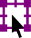 tool, right-click on "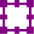 Grid Frame" border and select **Fit to Active Coverage**.

The grid frame will adjust to fit the active coverage entirely within it (Figure 5).

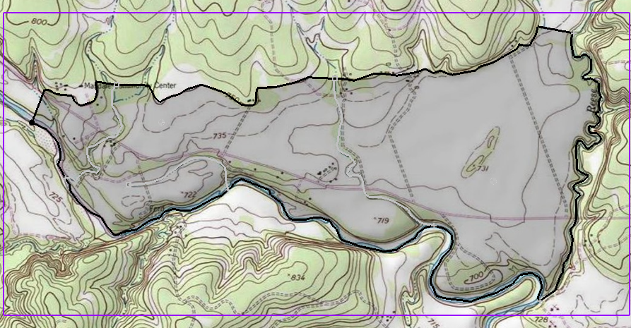

*Figure 5: The grid frame is the purple box around the coverage*

### 7.2 Creating the Grid

With the coverages and the grid frame created, it is now possible to create the grid.

1. Select " Rivers" in the Project Explorer to make it active.
2. Select *Feature Objects* | **Map** &rarr; **3D Grid** to bring up the *Create Finite Difference Grid* dialog.

Notice that the grid is dimensioned using the data from the grid frame. If a grid frame does not exist, the grid is defaulted to surround the model with approximately 5% overlap on the sides.

3. Under the *X-Dimension* and *Y-Dimension* sections, select *Cell size* for both and enter "20.0".
4. Click **OK** to close the *Create Finite Difference Grid* dialog.

A 3D grid will appear within the grid frame (Figure 6).

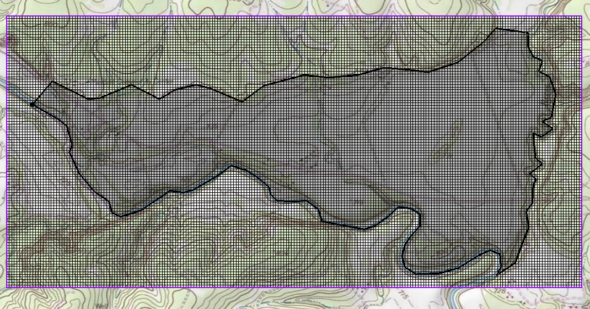

*Figure 6: 3D grid*

---

## 8 Preparing for the MODFLOW Model Run

### 8.1 Initializing the MODFLOW Data

Now that the grid is constructed, it is necessary to initialize the MODFLOW data before converting the conceptual model to a grid-based numerical model.

1. Right-click on the " grid" item in the Project Explorer and select **New MODFLOW...** to bring up the *MODFLOW Global/Basic Package* dialog.
2. Click **OK** to accept the defaults and close the *MODFLOW Global/Basic Package* dialog.

### 8.2 Defining the Active/Inactive Zones

With the grid constructed and MODFLOW initialized, the next step is to define the active and inactive zones of the model. This is accomplished automatically using the information in the local sources/sinks coverage.

1. Select the " Rivers" coverage in the Project Explorer to make it active.
2. Select *Feature Objects* | **Activate Cells in Coverage(s)**.

Each of the cells in the interior of any polygon in the local sources/sinks coverage is designated as active, and each cell outside of all of the polygons is designated as inactive. Notice that the cells on the boundary are activated such that the no-flow boundary at the top of the model approximately coincides with the outer cell edges of the cells on the perimeter while the specified head boundaries approximately coincide with the cell centers of the cells on the perimeter (Figure 7).

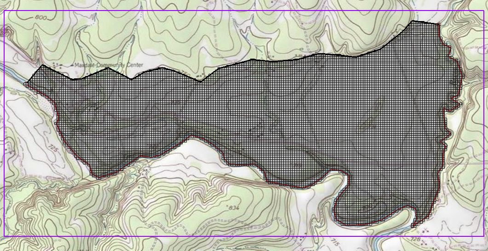

*Figure 7: Only active cells are visible*

### 8.3 Converting the Conceptual Model

It is now possible to convert the conceptual model from the feature object-based definition to a grid-based MODFLOW numerical model.

1. Right-click on the " East Texas" conceptual model and select *Map To* | **MODFLOW/MODPATH** to bring up the *Map* &rarr; *Model* dialog.
2. Select *All applicable coverages* and click **OK** to close the *Map* &rarr; *Model* dialog. The Graphics Window should appear as in Figure 8.

Notice that the cells underlying the general head boundaries were all identified and assigned the appropriate sources/sinks. The heads and elevations of the cells were determined by linearly interpolating along the general head arcs. In addition, the hydraulic conductivity values were assigned to the appropriate cells.

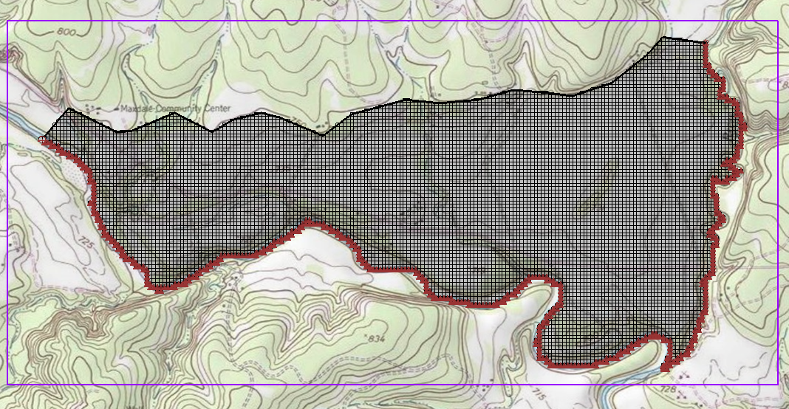

*Figure 8: After the conceptual model is converted to MODFLOW*

### 8.4 Defining the Starting Head

It is necessary to define the starting head before running MODFLOW. Because this tutorial is using the top elevation (230 m) as the starting head value, it is not necessary to make any changes because the starting heads are set to the grid top elevation by default.

### 8.5 Checking the Simulation

At this point, the MODFLOW data is completely defined and now ready to run the simulation. It is advisable to run the *Model Checker* to see if GMS can identify any mistakes that may have been made.

1. Select *MODFLOW* | **Check Simulation...** to bring up the *Model Checker* dialog.
2. Click **Run Check**. There should be no errors.
3. Click **Done** to exit the *Model Checker* dialog.

---

## 9 Saving and Running MODFLOW

Save the project before running MODFLOW.

1. Click the **Save**  macro.

Saving the project not only saves the MODFLOW files but it saves all data associated with the project including the feature objects and scatter points.

2. Select *MODFLOW* | **Run MODFLOW** to bring up the *MODFLOW* model wrapper dialog. The model run should complete quickly.
3. When MODFLOW is finished, turn on *Read solution on exit* and *Turn on contours* (if not on already).
4. Click **Close** to close the *MODFLOW* model wrapper dialog.

Contours should appear (Figure 9). These are contours of the computed head solution.

*Figure 9: The contours are visible after the MODFLOW model run*

---

## 10 Conclusion

This concludes the "MODFLOW -- Conceptual Model Approach 1" tutorial. Additional conceptual model tutorials further explore this approach. The following key concepts were demonstrated and discussed:

- A background image can be imported to help construct the conceptual model.
- It is usually a good idea to define the model boundary in a coverage and copy that coverage whenever it is necessary to create a new coverage.
- It is possible to customize the set of properties associated with points, arcs, and polygons by using the *Coverage Setup* dialog.
- Some arc properties, like head, are not specified by selecting the arc but by selecting the nodes at the ends of the arc. That way the property can vary linearly along the length of the arc.
- A grid frame can be used to position the grid but is not required.
- It is necessary to use the **Map** &rarr; **MODFLOW / MODPATH** command every time that conceptual model data is transferred to the grid.
