GMS 10.9

GMS 10.9 Tutorial

***MODFLOW -- Grid Approach***

Build a MODFLOW model on a 3D grid

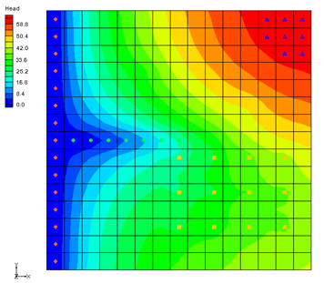

Objectives

The grid approach to MODFLOW pre-processing is described in this tutorial. In most cases, the conceptual model approach is more powerful than the grid approach. However, the grid approach is useful for simple problems or academic exercises where cell-by-cell editing is necessary.

Time

- 35--55 minutes

Required Components

- GMS Core

- MODFLOW Interface

Prerequisite Tutorials

- None

## Table of Contents

- [1 Introduction](#introduction)
  - [1.1 Getting Started](#getting-started)
- [2 Units](#units)
- [3 Creating the Grid](#creating-the-grid)
- [4 Creating the MODFLOW Simulation](#creating-the-modflow-simulation)
  - [4.1 Packages](#packages)
  - [4.2 The IBOUND Array](#the-ibound-array)
  - [4.3 Top and Bottom Elevations](#top-and-bottom-elevations)
  - [4.4 Starting Heads](#starting-heads)
- [5 Assigning IBOUND Values Directly to Cells](#assigning-ibound-values-directly-to-cells)
  - [5.1 Viewing the Left Column](#viewing-the-left-column)
  - [5.2 Selecting the Cells](#selecting-the-cells)
  - [5.3 Changing the IBOUND Value](#changing-the-ibound-value)
  - [5.4 Checking the Values](#checking-the-values)
- [6 The LPF Package](#the-lpf-package)
  - [6.1 Top Layer](#top-layer)
  - [6.2 Middle Layer](#middle-layer)
  - [6.3 Bottom Layer](#bottom-layer)
- [7 The Recharge Package](#the-recharge-package)
- [8 The Drain Package](#the-drain-package)
- [9 The Well Package](#the-well-package)
  - [9.1 Top Layer Wells](#top-layer-wells)
  - [9.2 Middle Layer Wells](#middle-layer-wells)
  - [9.3 Bottom Layer Wells](#bottom-layer-wells)
- [10 Checking and Saving the Simulation](#checking-and-saving-the-simulation)
- [11 Running MODFLOW](#running-modflow)
- [12 Viewing the Solution](#viewing-the-solution)
  - [12.1 Changing Layers](#changing-layers)
  - [12.2 Color Fill Contours and Color Legend](#color-fill-contours-and-color-legend)
- [13 Zone Budget](#zone-budget)
  - [13.1 Assigning Zone Budget IDs](#assigning-zone-budget-ids)
  - [13.2 Viewing the Zone Budget Report](#viewing-the-zone-budget-report)
- [14 Conclusion](#conclusion)

# Introduction 

Two approaches can be used to construct a MODFLOW simulation in GMS: the grid approach and the conceptual model approach. The grid approach involves working directly with the 3D grid to apply sources/sinks and other model parameters on a cell-by-cell basis. The conceptual model approach involves using the GIS tools in the Map module to develop a conceptual model of the site being modeled. The data in the conceptual model are then copied to the grid. The grid approach to MODFLOW pre-processing is described in this tutorial.

In most cases, the conceptual model approach is more efficient than the grid approach. However, the grid approach is useful for simple problems or academic exercises where cell-by-cell editing is necessary. Completing this tutorial is not required before beginning the conceptual model tutorials.

This tutorial uses a modified version of the sample problem (Figure 1) described near the end of the *MODFLOW Reference Manual*. Three aquifers will be simulated using three layers in the computational grid. The grid covers a square region measuring 75000 feet by 75000 feet.

The grid will consist of 15 rows and 15 columns, each cell measuring 5000 feet by 5000 feet in plan view. For simplicity, the elevation of the top and bottom of each layer will be flat. The hydraulic conductivity values shown are for the horizontal direction. For the vertical direction, the tutorial will use some fraction of the horizontal hydraulic conductivity.

Flow into the system is due to infiltration from precipitation and is defined as recharge in the input. Flow out of the system is due to buried drain tubes, discharging wells (not shown on the diagram), and a lake, which is represented by a constant head boundary on the left. Starting heads will be set equal to zero, and a steady state solution will be computed.

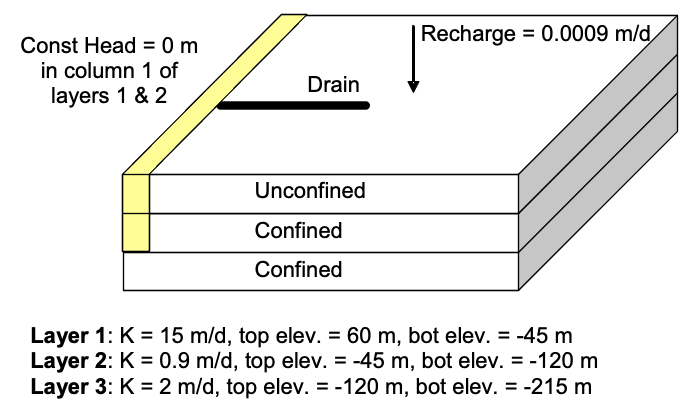

*Figure 1 Sample problem to be solved*

This tutorial discusses and demonstrates the following:

- Creating a 3D grid

- Setting up a MODFLOW simulation

- Checking the simulation and running MODFLOW

- Assigning zone budgets

- Viewing the report

## Getting Started

Do as follows to get started:

1.  If necessary, launch GMS.

2.  If GMS is already running, select *File \|* **New** command to ensure that the program settings are restored to their default state.

# Units

First, define the units used in the model. The units chosen will be applied to edit fields in the GMS interface as a reminder of the proper units for each parameter.

1.  Select *Edit* \| **Units...** to bring up the *Units* dialog.

2.  Click the  button next to the *Length* field to bring up the *Display Projection* dialog.

3.  Select "Meters" from the *Units* drop-down in both the *Horizontal* and *Vertical* sections.

4.  Click **OK** to close the *Display Projection* dialog.

5.  Select "d" (for days) from the *Time* drop-down. Ignore the other units as they are not used for flow simulations.

6.  Click **OK** to exit the *Units* dialog.

# Creating the Grid

The first step in solving the problem is to create the 3D finite difference grid.

1.  In the Project Explorer, right-click on the empty space and select *New \|* **3D Grid...** to bring up the *Create Finite Difference Grid* dialog.

2.  In both the *X-Dimension* and *Y-Dimension* sections, enter "22860.0" for *Length* and "15" for *Number cells*.

3.  In the *Z-Dimension* section, enter "3" for *Number cells*.

The top and bottom elevations will be entered later for each layer of the grid. Thus, the thickness of the cells in the *z* directions entered here will not affect the *MODFLOW* computations.

4.  Click **OK** to close the *Create Finite Difference Grid* dialog.

The grid should appear in the window in plan view. A simplified representation of the grid should also appear in the Mini-Grid Toolbar (Figure 2).

*Figure 2 Mini-Grid toolbar*

# Creating the MODFLOW Simulation

The next step is to initialize the MODFLOW simulation.

## Packages

1.  In the Project Explorer, right-click on " grid" and select **New MODFLOW...** to bring up the *MODFLOW Global/Basic Package* dialog.

First, select the packages. The input to *MODFLOW* is subdivided into packages. Some of the packages are optional and some are required. The Global and Basic packages are both always required, and are therefore always active. There are no settings to turn them on or off.

2.  Click **Packages...** to bring up the *MODFLOW Packages / Processes* dialog.

This dialog specifies which of the optional packages will be used to set up the model. To select the optional packages, do as follows:

3.  In the *Solver* section, select the *SIP1 --* *Stongly Impl. Proc*.

4.  In the *Optional packages / processes* section, turn on *DRN1 -- Drain, RCH1 -- Recharge*, and *WEL1 -- Well*.

5.  Click **OK** to exit the *MODFLOW Packages / Processes* dialog.

Do not close the MODFLOW Global/Basic Package dialog.

## The IBOUND Array

The next step is to set up the IBOUND array. The IBOUND array is used to designate each cell as either active (IBOUND \> 0), inactive (IBOUND = 0), or constant head (IBOUND \< 0). For this problem, all cells will be active, except for the first two layers in the leftmost column, which will be designated as constant head.

1.  Click **IBOUND...** to bring up the *IBOUND Array* dialog.

The values of the IBOUND array are displayed here in a spreadsheet-like fashion, one layer at a time. The edit field in the upper left corner of the dialog can be used to change the current layer. For this problem, all of the values in the array need to be greater than zero, except for the left column of the top two layers, which should be less than zero.

By default, the values in the array should already be greater than zero. Therefore, changing the values for the constant head cells is all that needs to be done. This can be accomplished by entering a value of "-1" for each of the thirty constant head cells.

However, there is another way to edit the IBOUND array that is much simpler for this case. This method will be described later in the tutorial. For now, leave all of the cells active.

2.  Click **Cancel** to exit the *IBOUND Array* dialog.

## Top and Bottom Elevations

The next step is to set up the top and bottom elevation arrays.

1.  Click **Top Elevation...** to bring up the *Top Elevation* dialog.

2.  Enter "1" for the *Layer*.

3.  Click **Constant → Layer...** to bring up the *Layer Value* dialog.

4.  Enter "60.0" for the *Constant value for layer*, and click **OK** to close the *Layer Value* dialog.

5.  Click **OK** to exit the *Top Elevation* dialog.

GMS forces the top of a layer to be at the same location as the bottom of the layer above. Thus, it is only necessary to enter the bottom elevations of all the layers now and the tops of the layers will be set automatically.

6.  Click **Bottom Elevation...** to bring up the *Bottom Elevation* dialog.

7.  Enter "1" for the *Layer*.

8.  Click **Constant → Layer...** to bring up the *Layer Value* dialog.

9.  Enter "-45.0" for the *Constant value for layer*, and click **OK** to close the *Layer Value* dialog.

10. Enter "2" for the *Layer*.

11. Click **Constant → Layer...** to bring up the *Layer Value* dialog.

12. Enter "-120.0" for the *Constant value for layer*, and click **OK** to close the *Layer Value* dialog.

13. Enter "3" for the *Layer*.

14. Click **Constant → Layer...** to bring up the *Layer Value* dialog.

15. Enter "-215.0" for the *Constant value for layer*, and click **OK** to close the *Layer Value* dialog.

16. Click **OK** to exit the *Bottom Elevation* dialog.

17. Turn on *Starting heads equal grid top elevation* near the bottom of the dialog.

18. Click **OK** to exit the *MODFLOW Global/Basic Package* dialog.

## Starting Heads

The starting heads array is used to establish an initial head value when performing a transient simulation. Since this project is computing a steady state simulation, the initial head for each cell shouldn\'t make a difference in the final solution.

However, the closer the starting head values are to the final head values, the more quickly MODFLOW will converge to a solution. Furthermore, for certain types of layers, if the starting head values are too low, MODFLOW may interpret the cells as being dry. For the problem at hand, the initial values are set to "60" because *Starting heads equal grid top elevation* is turned on in the *MODFLOW Global/Basic Package* dialog.

The starting heads array is also used to establish the head values associated with constant head cells. For this problem, the constant head values should be zero. Since all of the starting head values are already "60" by default, it will be necessary to make these changes later in the tutorial.

# Assigning IBOUND Values Directly to Cells

As mentioned above, the IBOUND values can be entered through the *IBOUND Array* dialog. In some cases, it is easier to assign values directly to cells. This can be accomplished by editing the properties of the cells. Before using the command, it is necessary to first select the cells in the leftmost column of the top two layers.

## Viewing the Left Column

To simplify the selection of the cells, change the display to make the leftmost layer visible.

1.  Turn on **Ortho Mode** .

2.  Switch to **Side View** .

The grid appears very thin. To make things easier, increase the Z magnification so that the grid appears stretched in the vertical direction:

3.  Click **Display Options**  to bring up the *Display Options* dialog.

4.  Enter "15.0" for the *Z magnification* and click **OK** to close the *Display Options* dialog.

## Selecting the Cells

Do the following to select the cells:

1.  Make sure **Ortho Mode**  is still on and select the **Select Cells**  tool so the Mini-Grid Toolbar appears

2.  Enter "1" in the Mini-Grid Toolbar and press the *Tab* key.

Notice column number one (the leftmost column) is now shown.

3.  Drag a box around all of the cells in the top two layers of the grid to highlight them (Figure 3).

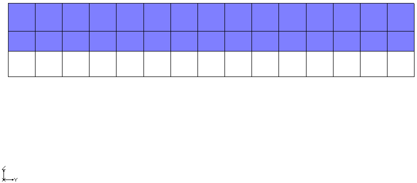

*Figure 3 Highlight the first two layers*

## Changing the IBOUND Value

To edit the IBOUND value:

1.  Right-click on one of the selected cells and select **Properties...** to bring up the *3D Grid Cell Properties* dialog.

2.  Select "Specified Head" from the drop-down in the *Value* column of the *IBOUND* row.

3.  Enter "0.0" in the *Value* column of the *Starting head* row.

4.  Click **OK** to exit the *3D Grid* *Cell Properties* dialog.

5.  Switch to **Plan View** .

Notice that an orange diamond symbol is displayed in the cells that were edited, indicating they are constant head cells (Figure 4).

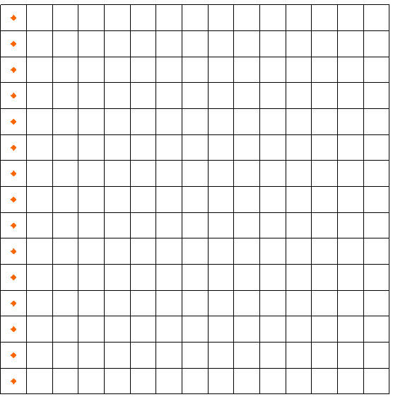

*Figure 4 Constant head cells marked on the left*

## 5.4 Checking the Values

To ensure that the IBOUND values were entered correctly:

1.  Select *MODFLOW* \| **Global Options...** to bring up the *MODFLOW Global/Basic Package* dialog.

2.  Click **IBOUND...** button to bring up the *IBOUND Array* dialog.

3.  Choose the up arrow to the right of the layer field in the upper left corner of the dialog to cycle through the layers.

Note that the cells in the leftmost column in the top two layers all have a value of "-1". Most of the *MODFLOW* input data can be edited in GMS using either a spreadsheet dialog such as this one, or by selecting a set of cells and entering a value directly.

4.  Click **Cancel** to exit the *IBOUND Array* dialog.

5.  Click **Cancel** to exit the *MODFLOW Global/Basic Package* dialog.

# The LPF Package

The next step is to enter the data for the Layer Property Flow (LPF) package. The LPF package computes the conductance between each of the grid cells and sets up the finite difference equations for the cell-to-cell flow.

To enter the LPF data:

1.  Select *MODFLOW \|* **LPF -- Layer Property Flow...** to bring up the *LPF Package* dialog.

2.  In the *Layer data* section, enter "1" for the *Layer*.

The options in the *Layer data* section are used to define the layer type and hydraulic conductivity data for each layer. This problem has three layers. The top layer is unconfined, and the bottom two layers are confined. The default *Layer type* in GMS is *Convertible*, which means the layer can be confined or unconfined. Thus, it isn't necessary to change the layer types.

The buttons on the right side of the *Layer Data* section are for entering the parameters necessary for computing the cell-to-cell conductances. MODFLOW requires a set of parameters for each layer depending on the layer type.

## Top Layer

First, enter the data for the top layer:

1.  Click **Horizontal Hydraulic Conductivity...** to bring up the *Horizontal Hydraulic Conductivity* dialog.

2.  Click **Constant → Layer** to bring up the *Layer Value* dialog.

3.  Enter a value of "15.0" for the *Constant value for layer* and click **OK** to close the *Layer Value* dialog.

4.  Click **OK** to exit the *Horizontal Hydraulic Conductivity* dialog.

5.  Click **Vertical Anisotropy (Kh/Kv)...** to bring up the *Vertical Anisotropy (Kh/Kv)* dialog.

6.  Click **Constant → Layer...** to bring up the *Layer Value* dialog.

7.  Enter "10.0" for the *Constant value for layer* and click **OK** to close the *Layer Value* dialog.

8.  Click **OK** to exit the *Vertical Anisotropy (Kh/Kv)* dialog.

## Middle Layer

Next, enter the data for the middle layer:

1.  In the *Layer data* section, enter "2" for the *Layer*.

2.  Repeat steps 1--8 from section 6.1, entering "0.9" for the *Constant value for layer* for the horizontal hydraulic conductivity and "5.0" for the *Constant value for layer* for the vertical anisotropy.

## Bottom Layer

Finally, enter the data for the bottom layer:

1.  In the *Layer data* section, enter "3" for the *Layer*.

2.  Repeat steps 1--8 from section 6.1, entering "2.0" for the *Constant value for layer* for the horizontal hydraulic conductivity and "5.0" for the *Constant value for layer* for the vertical anisotropy.

3.  When done, click **OK** to close the *LPF Package* dialog.

# The Recharge Package

Entering data in the recharge package allows simulation of the recharge to an aquifer due to rainfall and infiltration.

To enter the recharge data, do the following:

1.  Select *MODFLOW* \| *Optional Packages* \| **RCH -- Recharge...** to bring up the *MODFLOW Recharge Package* dialog.

2.  Click **Constant → Array** to bring up the *Grid Value* dialog.

3.  Enter "0.0009" for the *Constant value for grid* and click **OK** to close the *Grid Value* dialog.

4.  Click **OK** to exit the *MODFLOW Recharge Package* dialog.

# The Drain Package

The next step is to define the row of drains in the top layer of the model. To define the drains, first select the cells where the drains will be located, and then select the **Point Sources/Sinks** command.

The drains are located in the top layer (layer 1). Since this is the current layer, it isn't necessary to change the view.

Notice that as the cursor moves across the grid, the *IJK* indices of the cell beneath the cursor are displayed in the *Edit Window* at the bottom of the screen (Figure 5, bottom).

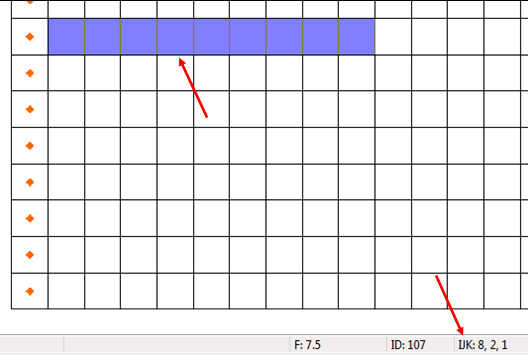

*Figure 5 Cells to be selected (top) and IJK indices of cell under cursor (bottom)*

To select the cells, do the following:

1.  Using the **Select Cells**  tool while holding down the *Shift* key, draw a box selecting cells 2--10 on row 8 (Figure 5, top). The first cell will indicate "IJK: 8,2,1", meaning "row 8, cell 2, layer 1" (Figure 5, bottom).

To assign drains to the cells:

2.  Right-click on one of the selected cells and select **Sources/Sinks...** to bring up the *MODFLOW Sources/Sinks* dialog.

3.  Select "Drain (DRN)" from the list on the left.

4.  Click **Add BC** to add a new instance of a drain to each of the selected cells.

At this point, enter an elevation and a conductance for the selected drains. The drains all have the same conductance but the elevations are not all the same.

5.  Enter the following values in the *Elevation (m)* and *Conductance (m\^2/d)* columns in the list of drains:

  -------------- ---------------------- ---------------------------------
        ID             Elevation                   Conductance

       107                0.0                        7430.0

       108                0.0                        7430.0

       109                3.0                        7430.0

       110                6.0                        7430.0

       111                9.0                        7430.0

       112                15.0                       7430.0

       113                20.0                       7430.0

       114                27.0                       7430.0

       115                30.0                       7430.0
  -------------- ---------------------- ---------------------------------

6.  Click **OK** to close the *MODFLOW Sources/Sinks* dialog.

7.  Deselect the cells by clicking anywhere outside the grid.

The drains should now be marked by green circles (Figure 6).

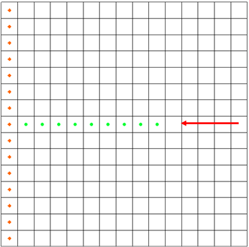

*Figure 6 Location of drain cells (green circles)*

# The Well Package

Several wells need to be defined. Most of the wells are in the top layer but some are in the middle and bottom layers.

## Top Layer Wells

Define the wells in the top layer (layer 1) first:

**Well Coordinates**

| row (i) | col (j) | lay (k) |
|---------|---------|---------|
| 9       | 8       | 1       |
| 9       | 10      | 1       |
| 9       | 12      | 1       |
| 9       | 14      | 1       |
| 11      | 8       | 1       |
| 11      | 10      | 1       |
| 11      | 12      | 1       |
| 11      | 14      | 1       |
| 13      | 8       | 1       |
| 13      | 10      | 1       |
| 13      | 12      | 1       |
| 13      | 14      | 1       |

1.  Using the **Select Cells**  tool while holding down the *Ctrl* key, select the cells shown in Figure 7 (the twelve cells containing yellow squares, rows indicated by red arrows). The coordinates of each well are shown in the table to the right.

2.  Right-click on a selected cell and select **Sources/Sinks...** to bring up the *MODFLOW Sources/Sinks* dialog.

3.  Select "Wells (WEL)" from the list on the left and click the **Add BC** button. Twelve well entries will appear in the spreadsheet area on the right side of the dialog.

4.  In the *All* row, enter "-12230" in the *Q (flow) (m\^3/d)* column.

A negative value signifies extraction.

5.  Click **OK** to close the *MODFLOW Sources/Sinks* dialog.

6.  Deselect the cells by clicking anywhere outside the grid.

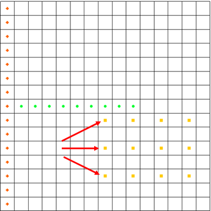

*Figure 7 Rows with wells (twelve yellow squares)*

## Middle Layer Wells

The wells in the middle layer (layer 2) need to be defined next. First, it is necessary to view the middle layer.

**Well Coordinates**

| row (i) | col (j) | lay (k) |
|---------|---------|---------|
| 4       | 6       | 2       |
| 6       | 12      | 2       |

1.  Click the *Up* arrow  in the Mini-Grid Toolbar switch to layer 2.

2.  Using the **Select Cells**  tool while holding down the *Ctrl* key, select the cells shown in Figure 8 (the two cells containing yellow squares, indicated by red arrows). The coordinates of each well are shown in the table to the right.

3.  Right-click on a selected cell and select **Sources/Sinks...** to bring up the *MODFLOW Sources/Sinks* dialog.

4.  Select "Wells (WEL)" from the list on the left and click the **Add BC** button. Two well entries will appear in the spreadsheet area on the right side of the dialog.

5.  In the *All* row, enter "-12230" in the *Q (flow) (m\^3/d)* column.

6.  Click **OK** to close the *MODFLOW Sources/Sinks* dialog.

7.  Unselect the cells by clicking anywhere outside the grid.

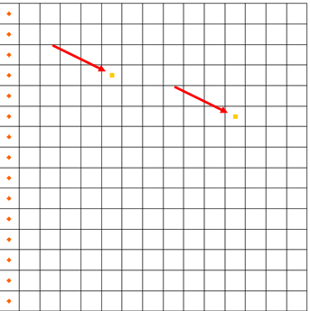

*Figure 8 Well locations*

## Bottom Layer Wells

Finally, define a single well on the bottom layer (layer 3):

1.  Click the *Up* arrow  in the Mini-Grid Toolbar to switch to layer 3.

2.  Using the **Select Cells**  tool, select the cell shown in Figure 9 (indicated by red arrow). The coordinates of the well are "IJK: 5, 11, 3".

3.  Right-click on the selected cell and select **Sources/Sinks...** to bring up the *MODFLOW Sources/Sinks* dialog.

4.  Select "Wells (WEL)" from the list on the left and click the **Add BC** button. One well entry will appear in the spreadsheet area on the right side of the dialog.

5.  Enter "-0.15" in the *Q (flow) (m\^3/d)* column.

6.  Click **OK** to close the *MODFLOW Sources/Sinks* dialog.

7.  Unselect the cell by clicking anywhere outside the grid.

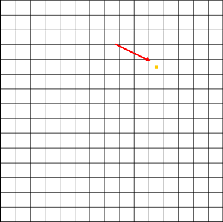

*Figure 9 Location of the single well in layer 3*

Now that all of the wells have been defined, it is possible to go back to the top layer.

8.  Click the down arrow  twice in the Mini-Grid Toolbar to go back to layer 1.

# Checking and Saving the Simulation

At this point, the MODFLOW data is completely defined and ready for the simulation run. Because of the significant amount of data required for a MODFLOW simulation, it is easy to omit some of the required data or to define inconsistent or incompatible options and parameters. Such errors will either cause MODFLOW to crash or to generate an erroneous solution. Before saving the simulation and running MODFLOW, always run the MODFLOW *Model Checker* and check for errors.

The purpose of the *Model Checker* is to analyze the input data currently defined for a MODFLOW simulation and report any obvious errors or potential problems. However, running the *Model Checker* successfully does not guarantee that a solution will be correct. It simply serves as an initial check on the input data and can save a considerable amount of time that would otherwise be lost tracking down input errors.

Do the following to run the *Model Checker*:

1.  Select *MODFLOW* \| **Check Simulation...** to bring up the *Model Checker* dialog.

2.  Click **Run Check** to initiate the model check.

A list of messages is shown for each of the MODFLOW input packages. If everything has been done correctly, the packages should have no errors. When an error exists, select the error in the *Model Checker* and GMS will select the cells or layers associated with the problem.

3.  When finished reviewing the results of the model check, click **Done** to exit the *Model Checker*.

4.  Select *File* \| **Save As...** to bring up the *Save As* dialog.

5.  Browse to the *modfgrid* directory.

6.  Select "Project Files (\*.gpr)" from the *Save as type* drop-down.

7.  Enter "gridmod.gpr" as the *File name* and click **Save** to save the project and close the *Save As* dialog.

# Running MODFLOW

It is now possible to run MODFLOW:

1.  Select *MODFLOW* \| **Run MODFLOW** to bring up the *MODFLOW* model wrapper dialog.

The super file name is passed to MODFLOW as a command line argument. MODFLOW opens the file and begins the simulation. As the simulation proceeds, some text output in the window will report the solution progress.

2.  When MODFLOW finishes, turn on *Read solution on exit* and *Turn on contours (if not on already)*.

3.  Click **Close** to exit the *MODFLOW* model wrapper dialog.

# Viewing the Solution

GMS imports the solution automatically when the MODFLOW window is closed. At this point, a set of head contours for the top layer should be seen. Some cells containing a light blue triangle symbol will also be visible (top right in Figure 10). These cells are flooded, meaning the computed water table is above the top of the cell.

1.  Click **Display Options**  to bring up the *Display Options* dialog.

2.  Select "3D Grid Data" from the list on the left.

3.  On the *MODFLOW* tab, click on the blue triangle button to the left of *Flooded cells* to bring up the *Symbol Attributes* dialog.

4.  Click the down-arrow button next to *Color* and select "Skyblue" from the list of colors.

5.  Click **OK** to close the *Symbol Attributes* dialog.

6.  Click **OK** to close the *Display Options* dialog.

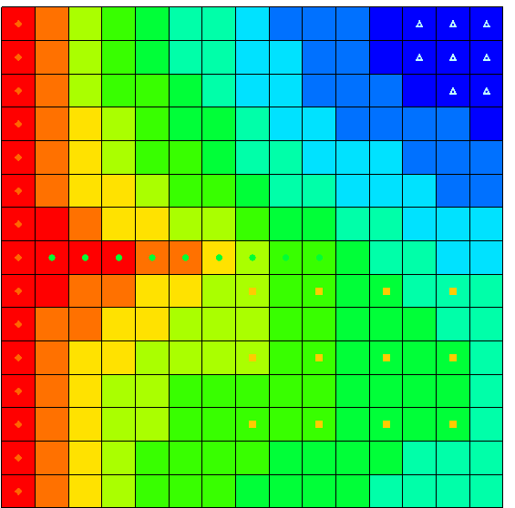

*Figure 10 Contours, with flooded cells at top right*

## Changing Layers

View the solutions on the middle and bottom layers by doing the following:

1.  Click the up arrow  in the Mini-Grid Toolbar to go to layer 2 (one click) or layer 3 (two clicks).

2.  When finished viewing the middle and bottom layer solutions, use the down arrow  to return to layer 1.

## Color Fill Contours and Color Legend

It is also possible to display the contours using a color fill option.

1.  Select *Display* \| **Contour Options...** to bring up the *Dataset Contour Options -- 3D Grid -- Head* dialog.

2.  In the *Contour method* section, select "Color Fill" from the top drop-down.

3.  At the bottom left, turn on *Legend.*

4.  Click **OK** to close the *Dataset Contour Options -- 3D Grid -- Head* dialog.

The Graphics Window should appear similar to Figure 11.

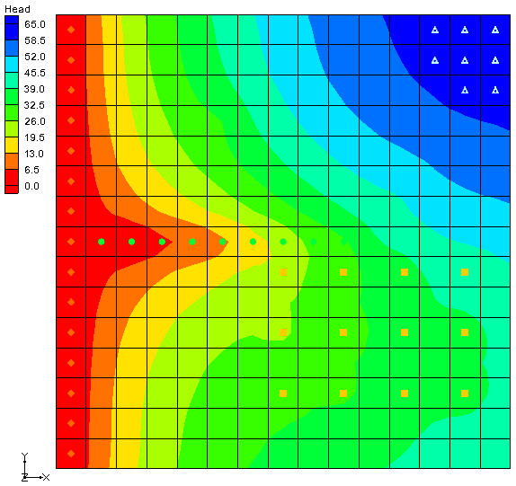

*Figure 11 Color fill contours with a legend*

# Zone Budget

Zone Budget is a program developed by the U.S. Geological Survey (USGS) to compute subregional water budgets for MODFLOW groundwater flow models. GMS has incorporated a similar flow budget reporting tool. In GMS, zones are defined by assigning a *Zone Budget ID* to cells. Once the zones are defined, a report can be generated that shows the flow budget for the zone. The report also includes a component that shows the flow in and out to adjacent zones.

## Assigning Zone Budget IDs

In this model, make each layer into a zone.

1.  Switch to **Plan View** .

2.  Use the up  or down  arrows on the Mini-Grid Toolbar to switch to layer 2 of the grid.

3.  Using the **Select Cells**  tool, drag a box around all of the cells in layer 2 of the grid.

4.  Right-click on one of the selected cells and select **Properties...** to bring up the *3D Grid Cell Properties* dialog.

5.  Enter "2" for the *Zone budget ID.*

6.  Click **OK** to close the *3D Grid Cell Properties* dialog.

7.  Use the Mini-Grid Toolbar to switch to layer 3 of the grid.

8.  Repeat steps 3 through 6, entering "3" for the *Zone budget ID*.

## Viewing the Zone Budget Report

It is now possible to view the flow budget for each of the zones.

1.  Select *MODFLOW* \| **Flow Budget...** to bring up the *Flow Budget* dialog.

2.  Switch to the *Zones* tab.

Currently, the report is showing information for the first zone (the top layer of the grid). The report is divided into two sections: flow into the zone and flow out of the zone. Every source/sink present in the model is listed in the report with a flow value. In addition to the sources/sinks, there is a field for the amount of flow that goes between zones.

3.  View the reports for the other two zones by selecting the desired zone from the *Zone* drop-down.

4.  When finished, click **OK** to exit the *Flow Budget* dialog.

# Conclusion

This concludes the "MODFLOW -- Grid Approach" tutorial. The following topics were discussed and demonstrated:

- It is possible to specify which units are being used and GMS will display the units next to input fields to help input the appropriate value. GMS does not do any unit conversions.

- The desired MODFLOW packages for use in the model can be selected by choosing the *MODFLOW \|* **Global Options...** command and clicking the **Packages...** button.

- Most MODFLOW array data can be edited in two ways: via a spreadsheet or by selecting grid cells and using the *MODFLOW \| Advanced \|* **Cell Properties...** command.

- Wells, drains, etc. can be created and edited by selecting the grid cell(s) and choosing the *MODFLOW \| Advanced \|* **Sources/Sinks...** command or by right-clicking on a selected cell and selecting the **Sources/Sinks...** command from the pop up menu.

- The *Model Checker* can be used to analyze the input data and check for errors.

- A flow budget report can be generated for a sub-region of the model by assigning Zone budget IDs to the grid and then using the **Flow Budget** command.
